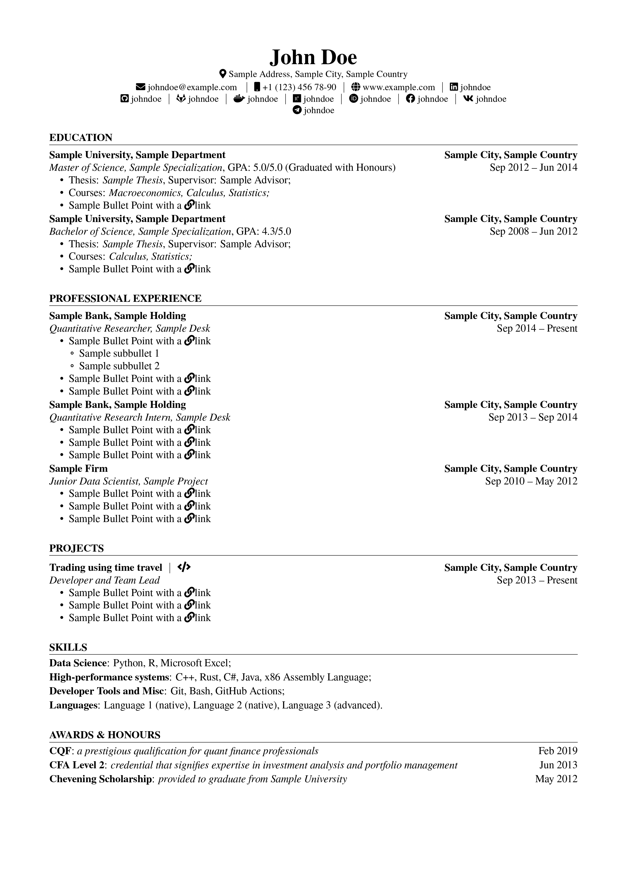
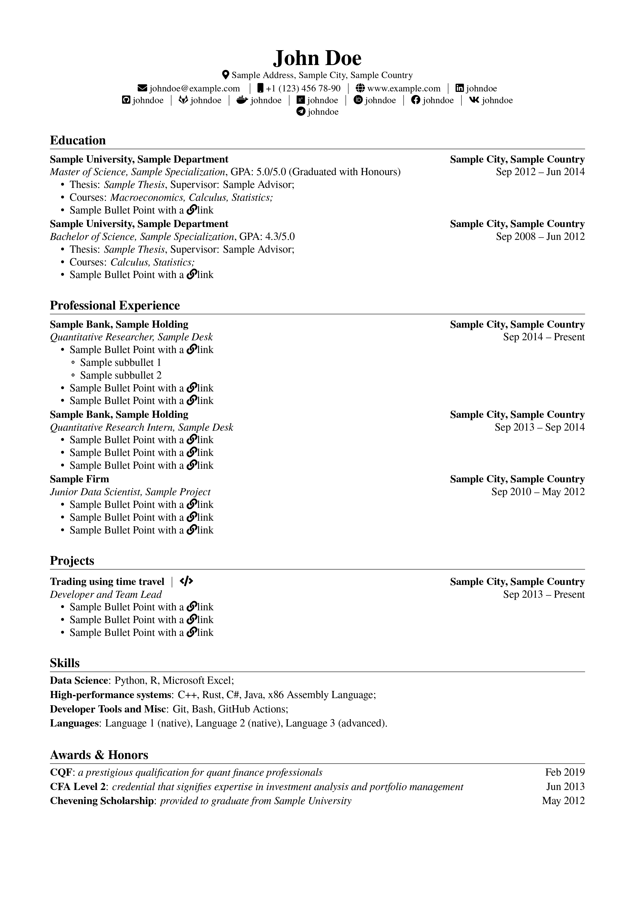

# `financecv` LaTeX Package
The `financecv.cls` package is designed for creating a sleek, professional curriculum vitae tailored to financial and academic profiles. It offers a simple interface to structure your résumé into clear sections like education, professional experience, projects, and more. This documentation explains how to use the package, including details on available commands and customization options.

## Overview

This package provides:  
- **Modular design:** Separate commands to declare personal information, education, work experience, projects, leadership roles, and other sections.  
- **Predefined stylistic options:** Easily switch between paper formats (A4 or Letter) and apply language customizations (e.g., English or Russian) through class options.  

| Example (caps) | Example (base) |
| -- | -- |
| |   |

## Class Options

When loading the class, you can pass several options:

- **Paper size options:**
  - `a4paper` (default): Sets the dimensions for A4 paper.
  - `letterpaper`: Sets the dimensions for U.S. letter size.
- **Layout options:**
  - `noline`: Omits horizontal lines under section titles.
  - `caps`: Converts section titles to uppercase.
  - `resume`: Redefines the inclusion command (`\cvinclude`) so that only essential elements are shown in a condensed version.
- **Language options:**
  - `english`: Activates English labels for sections (e.g., Education, Professional Experience).
  - `russian`: Activates Russian labels and formatting options.

## Personal Information Commands

Set your personal information before the document body using the following commands:
- `\name{...}` – Your full name.
- `\email{...}` – Your email address.
- `\phone{...}` and `\intphone{...}` – global and internal work phone numbers.
- `\address{...}` – Your mailing address.
- Social links such as:
  - `\linkedin{...}`, `\github{...}`, etc.

## Main Content Structure

The document is divided into several predefined sections using the following commands:

### Section Headers

Use `\cvsection{Section Title}` to create a section header. Predefined section commands include:
- `\education`
- `\experience`
- `\leadership`
- `\projects`
- `\skills`
- `\awards`
- `\publications`

### Job Entries with `\cvjob`

The `\cvjob` command is used to list education or work experience. Its syntax is as follows:

```latex
\cvjob{Location}
        {Sample company}
        {
            \cvrole{Date1}{Date2}{Sample job}
        }
        {
            \cvbullet{Detail 1: Key achievement or responsibility;}
            \cvbullet{Detail 2: Additional information.}
        }
```
  - **Argument 1:** Location (e.g., City, Country)  
  - **Argument 2:** Organization or company name  
  - **Argument 3:** Role details provided by a `\cvrole` command (with date range and job title)  
  - **Argument 4:** Detailed description using one or more `\cvbullet` commands
  
  ### Role Descriptions with `\cvrole`
  
  Use `\cvrole{Date Start}{Date End (Optional, replaced with <Since Date Start> if empty)}{Role Title}` to format a specific role or position within a job entry. Multiple `\cvrole` commands can be stacked if necessary.
  
  ### Bullet Points with `\cvbullet`
  
  The `\cvbullet{...}` command formats individual bullet points used to list responsibilities, achievements, or details under a job or project entry.
  
  ### Project Entries with `\project`
  
  The `\project` command helps format project entries. Its arguments cover date, location, project title, role, a detailed description (often using bullet points), and an optional URL link.
  
  ## Additional Commands
  
  - **\cvinclude:**  
    Conditionally includes content. With the `resume` option enabled, `\cvinclude{...}` may be redefined to omit non-essential parts for a condensed résumé version.
  - **Skill and Award Grouping:**  
    Use `\skillgroup{Category}{List of skills}` to group skills and `\award{Title}{Subtitle}{Dates}` to list accolades or awards.
  
  ## Header and Layout Configuration
  
  The class redefines `\maketitle` to create a custom header displaying your name and contact information. This header uses icons (from the `fontawesome5` package) and clickable links (via `hyperref`).
  
  Additional packages for layout and style include:
  - `geometry` for page margins,
  - `titlesec` for section spacing,
  - `enumitem` for list styling.
  
  ## Example Usage
  
  Here is an example of how to use `financecv.cls` in a document:
  
  ```latex
  \documentclass[caps,resume]{financecv}
  
  \name{Sample Name}
  \email{sample@example.com}
  \linkedin{sampleprofile}
  \github{sampleprofile}
  
  \begin{document}
      \education
          \cvjob{Sample City, Country}
              {Sample University}
              {\cvrole{Sep 20XX}{Jun 20XX}{Sample Degree Program}}
              {
                  \cvbullet{GPA: X.X/4.0; thesis topic: "Sample Thesis Title"}
              }
      \experience
          \cvjob{Sample City, Country}
              {Sample Company}
              {
                  \cvrole{Jan 20XX}{Present}{Sample Job Title}
              }
              {
                  \cvbullet{Implemented key features leading to improved productivity.}
                  \cvbullet{Collaborated with cross-functional teams to enhance workflow efficiency.}
              }
  \end{document}
  ```
  
  This example sets up personal data and outlines sections using the provided commands.
